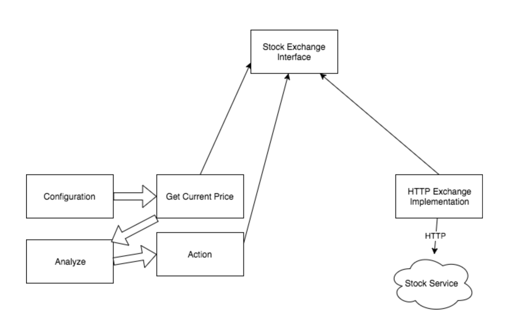

## 使用接口和依赖注入来证明您的设计

[转载翻译来自https://medium.com/dm03514-tech-blog/you-are-going-to-need-it-using-interfaces-and-dependency-injection-to-future-proof-your-designs-2cf6f58db192](https://medium.com/dm03514-tech-blog/you-are-going-to-need-it-using-interfaces-and-dependency-injection-to-future-proof-your-designs-2cf6f58db192)
#### 接口的使用是一种易于理解的技术，可以创建可测试和可扩展的代码。我一直认为它是最强大的建筑设计工具。
#### 本文的目标是介绍哪些接口，它们的使用方式以及它们如何实现扩展和可测试性。最后，它应该说明接口如何帮助更好地管理软件交付和调度

### Interfaces
#### 接口指定合同。根据语言或框架，可以明确强制执行或隐式强制执行。 Go提供了显式[`接口实施的示例`](https://play.golang.org/p/JYOGOe2va8h)。尝试使用某些东西作为接口而没有完全符合接口的东西将导致编译时错误。执行上面的示例会导致以下错误：
```
prog.go:22:85: cannot use BadPricer literal (type BadPricer) as type StockPricer in argument to isPricerHigherThan100:
	BadPricer does not implement StockPricer (missing CurrentPrice method)
Program exited.
```
#### 接口是一种通过使用合同将呼叫者和被呼叫者分离的工具。
#### 让我们尝试通过自动股票交易者的例子使其更具体。股票交易者将使用设定买入价和股票代码进行调用.然后它将与交易所交谈，以便检索该符号的当前价格。然后，如果股票代码低于买入价，它将进行购买。

#### 程序的简单架构草图可能与上图类似。上面的示例显示获取当前价格与HTTP直接相关，以便与股票服务对话
#### Action状态也直接依赖于HTTP。这要求两个州都需要直接了解如何使用HTTP来检索股票数据和/或进行交易。

#### 实现可能如下所示 :
```go
func analyze(ticker string, maxTradePrice float64) (bool, err) {
  resp, err := http.Get(
      "http://stock-service.com/currentprice/" + ticker
  )
  if err != nil {
  	// handle error
  }
  defer resp.Body.Close()
  body, err := ioutil.ReadAll(resp.Body)
  // ...
  currentPrice := parsePriceFromBody(body)
  var hasTraded bool
  var err error
  if currentPrice <= maximumTradePrice {
    err = doTrade(ticker, currentPrice)
    if err == nil {
      hasTraded = true
    }
  }
  return hasTraded, err
}
```
#### 这里调用者（analyze）对HTTP有直接的硬依赖。它需要知道如何形成HTTP请求。它需要了解如何解析响应。它需要了解如何处理重试，超时，身份验证等。[`它与http紧密耦合`](https://en.wikipedia.org/wiki/Coupling_%28computer_programming%29)`当我们想要调用analyze时，我们都需要调用http库`

#### 界面如何帮助？我们可以使用接口提供的契约来指定行为，而不是具体的实现。有关特定于接口的特定用法的更多信息，请参见[`此处`](https://medium.com/golangspec/interfaces-in-go-part-i-4ae53a97479c)。

```
type StockExchange interface {
  CurrentPrice(ticker string) float64
}
```
#### 以上定义了StockExchange的概念。它定义了StockExchange支持单个函数调用CurrentPrice。我发现这三条线是最强大的建筑技术.它们允许我们更好地控制应用程序依赖性。他们启用测试。它们可以扩展。

## 依赖注入
#### 为了完全实现接口的价值，我们需要使用一种称为依赖注入的技术。

[`依赖注入`](https://en.wikipedia.org/wiki/Dependency_injection)指定调用者提供被调用者需要的东西。 这通常采用调用者配置对象的形式，然后将该对象传递给被调用者。 然后从配置和实现中抽象出被调用者。 这里有一定程度的间接。 考虑HTTP Rest服务请求。 为了实现客户端，我们需要使用一个理解如何处理形成，发送和接收HTTP请求的HTTP库。

如果我们将HTTP请求放在接口后面，则调用者可以解耦并且仍然不知道HTTP请求实际发生。

调用者只会调用泛型函数调用。 它可以是本地调用，远程调用，HTTP调用，RPC调用等。调用者不是更明智的，只要它得到预期的结果通常不关心。 下面显示了依赖注入在我们的分析方法中的外观。
```
func analyze(se StockExchange, ticker string, maxTradePrice float64) (bool, error) {
  currentPrice := se.CurrentPrice(ticker)
  var hasTraded bool
  var err error
  if currentPrice <= maximumTradePrice {
    err = doTrade(ticker, currentPrice)
    if err == nil {
      hasTraded = true
    }
  }
  return hasTraded, err
}
```
我仍然不能不对这里发生的事感到惊讶。 我们已完成倒置我们的依赖树并更好地控制我们的程序。 不仅如此，但实现在视觉上看起来更清晰，更容易理解。 我们可以清楚地看到，分析需要获取当前价格，检查该价格是否合格然后进行交易。 最重要的是，这可以使呼叫者和被呼叫者分离。 由于调用者和实现通过接口解耦，因此它允许扩展具有多个不同实现的接口。 接口支持多种不同的具体实现，不需要更改被调用者代码！


程序的获取当前价格状态仅取决于StockExchange接口。它对与实际库存服务进行通信，如何存储价格或如何进行请求一无所知。它幸福地没有意识到。这种关系是双向的。 HTTPStockExchange实现也对分析一无所知。它不知道它执行的位置或何时的上下文，因为它不是直接调用的。

由于程序的某些部分（依赖于接口的部分）不需要随着具体实现的更改/添加/删除而改变，因此它将来会对设计进行校对。假设我们发现StockService经常不可用。

以上示例与函数调用有何不同？函数调用也会清理实现。不同之处在于函数调用仍然需要调用HTTP。 analyze只是委托给一个调用http而不是直接调用http的函数。这里的功能来自“注入”，即调用者向被调用者提供接口。这就是创建依赖性反转的原因，其中获取价格仅依赖于接口而不依赖于实现。

## 开箱即用的多种实现
目前我们有一个分析函数和一个StockExchange接口，但我们无法做任何有用的事情。 我们只宣布了我们的计划。 它目前不可调用，因为我们还没有任何具体实现来实现我们的接口。

下图仅关注获取当前价格状态及其对StockExchange界面的依赖性。 下面显示了两个完全不同的实现如何并排存在并且获得当前价格并不是更明智的。 此外，两个实现都没有连接到另一个，两者都只依赖于StockExchange接口。


## Production(生产)
最初的HTTP实现已经存在于我们最初的分析(analyze)实现中，我们只需要将它封装在一个具体的接口实现后面。
```
type HTTPStockExchange struct {}
func (se HTTPStockExchange) CurrentPrice(ticker string) float64 {
  resp, err := http.Get(
      "http://stock-service.com/currentprice/" + ticker
  )
  if err != nil {
  	// handle error
  }
  defer resp.Body.Close()
  body, err := ioutil.ReadAll(resp.Body)
  // ...
  return parsePriceFromBody(body)
}
```
之前与分析功能相关联的内容现在是独立的并且满足StockExchange界面，这意味着我们可以将其传递给分析。请记住，从上面的图表中，分析不再直接依赖于HTTP。使用界面使得分析不知道幕后发生了什么。它只知道它保证传递一个可以调用CurrentPrice的对象。

我们在这里也获得了封装的一般好处。在http请求被耦合到分析之前，通过http间接地通过分析方法来实现与交换通信的唯一方式。虽然我们可以在函数后面封装这些调用并独立地执行函数，但是接口迫使我们将调用者和被调用者分离。我们现在可以独立于其调用者单独测试实际的HTTPStockExchange。这对我们的测试范围以及我们如何理解和响应测试失败产生了巨大的反响。

## Testing


322/5000
使用我们当前的代码，我们有一个HTTPStockService结构，允许我们单独验证它是否可以与Stock Service进行通信并解析响应。 但是我们如何以可靠的可重复方式测试分析是否可以通过StockExchange界面的响应做正确的事情。
```
currentPrice := se.CurrentPrice(ticker)
 if currentPrice <= maxTradePrice {
    err := doTrade(ticker, currentPrice)
  }
 ```
 我们可以使用HTTP实现，但这有许多缺点。在单元测试中进行网络呼叫可能很慢，尤其是外部服务。延迟和网络剥落可能使测试不可靠。此外，如果我们想要一个断言的测试我们可以进行交易和测试断言我们可以在我们不应该进行交易时过滤掉，找到可靠地满足这两个条件的生产数据可能很难。我们可以选择一个人工模拟每个条件的maxTradePrice，即maxTradePrice：= -100不会交易，maxTradePrice：= 10000000应该合理地导致交易。

但是，如果我们有股票服务配额会怎样？或者如果我们必须支付访问费用会怎样？我们是否真的，或者是否应该支付或使用我们的单位测试配额？理想情况下，我们会非常频繁地运行测试，因此它们应该快速，便宜且可靠。我希望上面的段落解释了为什么使用实际的HTTP版本不符合我们的测试目标！

There’s a better way and its enabled through the use of interfaces!
有一种更好的方法，并通过使用接口启用它！

拥有一个界面使我们能够精心制作StockExchange实施，这将使我们能够快速，安全，可靠地进行分析。

```
type StubExchange struct {
   Price float64
}
func (se StubExchange) CurrentPrice(ticker string) float64 {
   return se.Price
}
func TestAnalyze_MakeTrade(t *testing.T) {
  se := StubExchange{Price: 10}
  maxTradePrice := 11
  traded, err := analyze(se, "TSLA", maxTradePrice)
  if err != nil {
     t.Errorf("expected err == nil received: %s", err)
  }
  if !traded {
    t.Error("expected traded == true")
  } 
}
func TestAnalyze_DontTrade(t *testing.T) {
  se := StubExchange{Price: 10}
  maxTradePrice := 9
  traded, err := analyze(se, "TSLA", maxTradePrice)
  // assertions
}
```

以上使用存根交换来触发分析中的所需分支。 然后每个测试都进行断言以验证分析是否正确。 虽然这是一个测试程序，但在我的经验中，利用类似这种方式的接口的组件/体系结构最终会在实际代码中进行这样的测试！ 由于接口，我们可以使用内存可控的StockExchange，它允许可靠，易于配置，易于理解，可重复和快速的测试！

## Decoupling — Caller Configuration (解耦 - 呼叫者配置)

现在我们已经介绍了如何使用接口来解耦调用者和被调用者以及如何实现多个具体实现，我们仍然缺少关键组件。 我们如何在特定时间配置和提供特定实现？ 我们可以直接调用analyze函数但是生产配置怎么样？

这就是依赖注入的用武之地。

```
func main() {
   var ticker = flag.String("ticker", "", "stock ticker symbol to trade for")
   var maxTradePrice = flag.Float64("maxtradeprice", "", "max price to pay for a share of the ticker symbol."
   se := HTTPStockExchange{}
  analyze(se, *ticker, *maxTradePrice)
}
```

与我们的测试类似，将使用分析的StockExchange的具体具体实现是由其调用者在分析之外配置的。 然后将其传入（注入）分析。 这允许它让analyze知道如何配置HTTPStockExchange。 也许我们想要将我们将用于交换的http域公开为命令行标志，analyze不必更改。 或者，如果我们需要提供某种身份验证或令牌来访问从环境中提取的HTTPStockExchange？ 再次分析将不必改变。 配置发生在分析之外的层，完全隔离分析必须配置其依赖关系的责任。 这使得能够严格分离关注点。

## Deferring decisions
好像上面的例子还不够，接口和DI有很多好处。接口允许推迟有关具体实现的决定，直到以后。虽然接口要求我们对要支持的行为做出决定，但是能够推迟有关特定实现的决策。假设我们知道我们想进行自动交易，但我们仍然不确定使用哪个股票供应商？我们在数据存储方面始终看到类似的决策类。我们的程序应该使用mysql，postgres，redis，filesystem，cassandra吗？这些最终是实现细节，界面使我们能够推迟做出这些决定。它们使我们能够继续推进我们计划的业务逻辑，但是等待以后做出这些技术特定的决定！

虽然这本身为我们留下了许多可能性，但它也为我们的项目安排提供了一些神奇的东西。想象一下，如果我们将其他依赖项移动到交换接口。


我们已经将我们的架构重新安排为DAG，这样一旦我们就我们的证券交易所界面达成一致，我们就可以通过HTTPStockExchange与CONStockURRENTLY继续前进。我们创造了一种情况，即在项目中添加另一个人将有助于项目更快地进行。像这样按摩我们的架构使我们能够更好地预测我们能够利用更多人来帮助我们更快地交付的地点，时间和时长。此外，由于接口的解耦性质，实现接口通常很容易被引导。我们可以完全独立于我们的程序开发，测试和验证HTTPStockExchange！

分析体系结构依赖性，并根据这些依赖性进行调度，可以大规模地加速项目。使用这种精确的技术，我已经能够提供多个月的项目，只需花费一小部分时间。我希望将来能够写出更多关于这种特定技术的信息！

## Future Proofing

到现在为止，接口和依赖注入如何有助于未来证明我们的设计更加清晰。 也许我们改变了我们的股票服务提供商，或者我们实时转移和保存报价，或任何数量的不同可能性。 按原样分析将支持任何能够合并到StockExchange界面的实现。
```
se.CurrentPrice(ticker)
```
这使我们无法在大量案件中进行变革。 并非所有情况都是我们可能遇到的许多可预测的情况。 除了保护我们不必更改分析代码并重新验证其核心功能外，还可以轻松地提供新的实现，或者按照这些方式切换提供程序。 它还允许我们无缝扩展或更新我们已有的具体实现，而无需更改或重新验证分析！

----
我希望上面的例子说明如何通过使用接口解耦完全反转依赖关系并将调用者与被调用者隔离开来。由于它是分离的，因此它不依赖于特定的实现，而是严格依赖于特定的行为。许多不同的实现可以实现这种行为。这是设计的关键，也被称为[`鸭子打字`](https://en.wikipedia.org/wiki/Duck_typing)。

接口的概念，取决于行为而不是实现，是一个如此强大的概念决定采用它作为语言原语的接口，以一种非常激进的方式。在go中，结构不必明确声明与接口的兼容性，在编译期间将通过go评估和检查合规性。这会创建一个额外的解耦级别，因为在声明结构时，它不需要知道它将在何时何地或在何种上下文中使用。

我希望上面的例子展示了界面和DI是如何在项目一开始就使用的强大技术！我从事DO工作的几乎所有项目都从一开始就需要多个实现：生产实现和测试。

----
如果你喜欢这个，我很快就会发表一篇文章，说明使用这些技术设计，构建和测试完整的应用程序。

谢谢你的阅读！