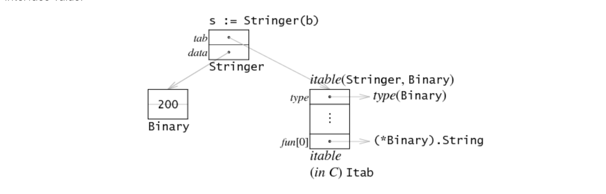
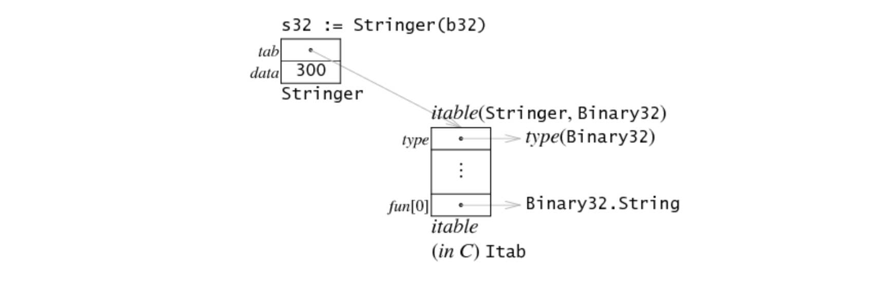

# Go Data Structures: Interfaces


[转载翻译https://research.swtch.com/interfaces](https://research.swtch.com/interfaces)

Go的接口 - 静态，在编译时检查，在被要求时是动态的，对我来说，从语言设计的角度来看，Go中最激动人心的部分。如果我可以将Go的一个功能导出到其他语言，它将是接口。

这篇文章是我对“gc”编译器中接口值的实现的看法：6g，8g和5g。在Airs，Ian Lance Taylor写了 两篇 关于接口值实现的帖子gccgo。实现更加相似而不同：最大的区别在于这篇文章有图片。

在查看实现之前，让我们了解它必须支持的内容。

#### Usage 用法
Go的接口允许你像在Python这样的纯动态语言中使用 鸭子类型，但仍然让编译器捕获明显的错误，例如传递int带有Read方法的对象的位置，或者调用Read带有错误数量的参数的方法。要使用接口，首先要定义接口类型（比方说ReadCloser）：

```go
type ReadCloser interface {
    Read(b []byte) (n int, err os.Error)
    Close()
}
```
然后将你的新功能定义为ReadCloser。例如，此函数Read重复调用以获取所请求的所有数据，然后调用Close：

```go
func ReadAndClose(r ReadCloser, buf []byte) (n int, err os.Error) {
    for len(buf) > 0 && err == nil {
        var nr int
        nr, err = r.Read(buf)
        n += nr
        buf = buf[nr:]
    }
    r.Close()
    return
}
```
调用的代码ReadAndClose，只要可以传递任何类型的值，因为它有Read和Close用正确的签名的方法。并且，与Python之类的语言不同，如果传递的类型错误，则在编译时会出错，而不是运行时。

但是，接口不限于静态检查。您可以动态检查特定接口值是否具有其他方法。例如：

```go
type Stringer interface {
    String() string
}

func ToString(any interface{}) string {
    if v, ok := any.(Stringer); ok {
        return v.String()
    }
    switch v := any.(type) {
    case int:
        return strconv.Itoa(v)
    case float:
        return strconv.Ftoa(v, 'g', -1)
    }
    return "???"
}
```
该值any具有静态类型 interface{}，这意味着根本不保证任何方法：它可以包含任何类型。if 语句中的“逗号ok”赋值询问是否可以转换any为Stringer具有该方法的type的接口值String。如果是这样，该语句的主体调用该方法来获取要返回的字符串。否则，switch在放弃之前选择一些基本类型。这基本上是fmt包所做的精简版 。（if可以通过case Stringer:在顶部添加来替换 switch，但我使用单独的语句来引起对检查的注意。）

举一个简单的例子，让我们考虑一个64位整数类型，它带有一个String以二进制方式打印值的方法和一个简单的Get方法：

```go
type Binary uint64

func (i Binary) String() string {
    return strconv.Uitob64(i.Get(), 2)
}

func (i Binary) Get() uint64 {
    return uint64(i)
}
```
Binary可以传递类型的值，ToString使用该String 方法将其格式化，即使程序从未说过 Binary打算实现Stringer。没有必要：运行时可以看到Binary 有一个String方法，所以它实现了Stringer，即使作者Binary从未听说过 Stringer。

这些示例表明，即使在编译时检查了所有隐式转换，显式的接口到接口转换也可以在运行时查询方法集。“ Effective Go ”提供了有关如何使用接口值的更多详细信息和示例。

#### Interface Values 接口值
使用方法的语言通常属于两个阵营中的一个：静态地为所有方法调用准备表（如在C ++和Java中），或者在每次调用时进行方法查找（如Smalltalk及其中的许多模仿者，包括JavaScript和Python）和添加花哨的缓存以使该调用有效。Go位于两者之间：它有方法表，但在运行时计算它们。我不知道Go是否是使用这种技术的第一种语言，但它肯定不是常见的。（我有兴趣了解前面的例子;请在下面留言。）

作为预热，类型的值Binary只是由两个32位字组成的64位整数（就像在上一篇文章中，我们将假设一个32位机器;这次内存向下而不是向右）：


接口值表示为双字对，给出指向存储在接口中的类型信息的指针和指向相关数据的指针。分配b类型的接口值Stringer 设置接口值的两个单词。


（接口值中包含的指针是灰色的，以强调它们是隐式的，而不是直接暴露给Go程序。）

接口值中的第一个单词指向我称之为接口表或itable（发音为i-table;在运行时源中，C实现名称为Itab）。itable从一些有关所涉及类型的元数据开始，然后成为函数指针列表。请注意，itable对应于接口类型，而不是动态类型。就我们的例子而言，Stringer持有类型的itable Binary 列出了用于满足的方法Stringer，这只是String：Binary其他方法（Get）在itable中没有出现。

接口值中的第二个字指向实际数据，在这种情况下是一个副本b。由于var s Stringer = b制作副本的 原因相同，所以赋值副本b而不是指向 ：如果稍后更改， 并且应该具有原始值，而不是新值。存储在接口中的值可能是任意大的，但只有一个字专用于将值保存在接口结构中，因此赋值在堆上分配一块内存并将指针记录在单字槽中。（当值恰好适合插槽时，有一个明显的优化;我们稍后会讨论它。） bvar c uint64 = bbsc

要检查接口值是否包含特定类型（如上面的类型开关），Go编译器会生成与C表达式等效的代码，s.tab->type以获取类型指针并根据所需类型进行检查。如果类型匹配，则可以通过解除引用来复制该值s.data。

要调用s.String()，Go编译器会生成与C表达式等效的代码 s.tab->fun[0](s.data)：它从itable调用相应的函数指针，将接口值的数据字作为函数的第一个（仅在此示例中）参数传递。如果你运行，你可以看到这个代码8g -S x.go（详见本文的底部）。请注意，itable中的函数是从接口值的第二个字传递32位指针，而不是它指向的64位值。通常，接口调用站点不知道该单词的含义，也不知道它指向的数据量。相反，接口代码安排itable中的函数指针期望存储在接口值中的32位表示。因此，此示例中的函数指针(*Binary).String 不是Binary.String。

我们正在考虑的例子是只有一种方法的接口。具有更多方法的界面将在itable底部的fun列表中包含更多条目。

#### Computing the Itable计算Itable
现在我们知道它们的样子了，但它们来自哪里？Go的动态类型转换意味着编译器或链接器预先计算所有可能的itables是不合理的：有太多（接口类型，具体类型）对，并且大多数都不需要。相反，编译器生成用于每个具体类型像类型描述结构Binary或int或func(map[int]string)。在其他元数据中，类型描述结构包含由该类型实现的方法的列表。类似地，编译器为每个接口类型生成（不同的）类型描述结构Stringer; 它也包含一个方法列表。接口运行时通过查找具体类型的方法表中接口类型的方法表中列出的每个方法来计算itable。运行时在生成它之后缓存itable，因此这种对应只需要计算一次。

在我们的简单示例中，方法表 Stringer有一个方法，而表 Binary有两个方法。通常，可能有接口类型的ni方法和具体类型的nt方法。找到从接口方法到具体方法的映射的明显搜索将花费O（ni × nt）时间，但我们可以做得更好。通过对两个方法表进行排序并同时处理它们，我们可以在O（ni + nt）时间内构建映射。

#### Memory Optimizations内存优化
上述实现所使用的空间可以以两种互补的方式进行优化。

首先，如果涉及的接口类型为空 - 它没有方法 - 那么除了将指针保持在原始类型之外，itable没有用处。在这种情况下，可以删除itable，并且值可以直接指向类型：


接口类型是否具有方法是静态属性 - 或者源代码中的类型说 interface{}或者说 - interace{ methods... }编译器知道程序中每个点正在使用哪个表示。

其次，如果与接口值关联的值可以适合单个机器字，则无需引入间接或堆分配。如果我们定义 Binary32为类似Binary 但实现为a uint32，则可以通过将实际值保存在第二个单词中来存储在接口值中：


实际值是指向还是内联取决于类型的大小。编译器安排类型的方法表中列出的函数（将其复制到itables中）以使用传入的单词执行正确的操作。如果接收器类型适合单词，则直接使用; 如果没有，它被解除引用。图表显示了这一点：在Binary上面的版本中，itable中的方法是 (*Binary).String，而在 Binary32示例中，itable中的方法Binary32.String 不是(*Binary32).String。

当然，保持字大小（或更小）值的空接口可以利用这两种优化：


#### Method Lookup Performance方法查找性能
Smalltalk及其后面的许多动态系统每次调用方法时都会执行方法查找。为了提高速度，许多实现在每个调用站点使用简单的单项缓存，通常在指令流本身。在多线程程序中，必须小心管理这些高速缓存，因为多个线程可以同时位于同一个调用站点。即使一旦避免了比赛，缓存最终也会成为内存争用的来源。

因为Go具有静态类型的提示以与动态方法查找一起使用，所以它可以将查找从调用站点移回到值存储在接口中的点。例如，请考虑以下代码段：

```go
1   var any interface{}  // initialized elsewhere
2   s := any.(Stringer)  // dynamic conversion
3   for i := 0; i < 100; i++ {
4       fmt.Println(s.String())
5   }
```
在Go中，在第2行的赋值期间计算（或在缓存中找到）itable; s.String()在第4行执行的调用的调度 是一对内存提取和一个间接调用指令。

相比之下，使用Smalltalk（或JavaScript，或Python等）这样的动态语言实现此程序将在第4行进行方法查找，这在循环中重复了不必要的工作。前面提到的缓存使它比它可能更便宜，但它仍然比单个间接调用指令更昂贵。

当然，这是一篇博客文章，我没有任何数字来支持这个讨论，但看起来缺乏内存争用似乎是一个重大并行程序的大赢家，因为能够移动方法查找紧密循环。另外，我说的是通用架构，而不是实现的细节：后者可能还有一些常量因子优化仍然可用。

### More Information更多信息
接口运行时支持在 $GOROOT/src/pkg/runtime/iface.c。关于接口（我们还没有看到指针接收器的例子）和类型描述符（它们除了接口运行时之外还有功率反射）还有很多话要说，但那些将不得不等待未来的帖子。

### code
#### Supporting code (x.go):
```go
package main

import (
 "fmt"
 "strconv"
)

type Stringer interface {
 String() string
}

type Binary uint64

func (i Binary) String() string {
 return strconv.Uitob64(i.Get(), 2)
}

func (i Binary) Get() uint64 {
 return uint64(i)
}

func main() {
 b := Binary(200)
 s := Stringer(b)
 fmt.Println(s.String())
}

```
```
Selected output of 8g -S x.go:

0045 (x.go:25) LEAL    s+-24(SP),BX
0046 (x.go:25) MOVL    4(BX),BP
0047 (x.go:25) MOVL    BP,(SP)
0048 (x.go:25) MOVL    (BX),BX
0049 (x.go:25) MOVL    20(BX),BX
0050 (x.go:25) CALL    ,BX
```

将LEAL地址加载s 到寄存器中BX。（符号n(SP)描述了内存中的单词。 可以缩短为。）接下来的两个指令从接口中的第二个字中获取值，并将其存储为第一个函数调用参数。最后两条指令从itable中获取itable然后是函数指针，以准备调用该函数。 SP+n0(SP)(SP)MOVL0(SP)MOVL
# -----------------------------------------------------------------

# （评论最初是通过Blogger发布的。）

### rog peppe （2009年12月2日上午2:42） Go的界面让你像使用Python

这样的纯动态语言一样使用鸭子打字，这已经说了很多，但我不认为这是真的。鸭子打字更深入。例如，如果我有一个用于算术运算的API：


```go
type Foo struct { ... };

func (f0 *Foo)Add(f1 *Foo) *Foo;
func (f0 *Foo)Negate() *Foo;
```
等等，这与响应相同方法的任何其他类型兼容，包括其方法返回的对象上的方法。如果接口真的像鸭子类型，那么上面的结构将与这个接口兼容：
```go
type Arith interface {
    Add(f1 Arith) Arith;
    Negate() Arith;
}
```

，但它不是。

### Fred Blasdel （2009年12月2日上午3:26）

它比rog更糟糕：Go语言本身并不使用它为用户提供的多态性机制（接口）及其使用的（参数）数组和地图）仅供其使用。

他们可以理解地害怕超载，而古典主义反革命分子可能会扰乱语言的公共发展（参见Prototype.js，这是一个特别讽刺和令人沮丧的例子）。他们必须小心他们添加的内容。


我不知道Go是否是使用这种技术的第一种语言，但它肯定不是常见的。

我确信在Cardelli和Abadi的“对象理论”中对此进行了讨论，但我没有自己的副本。一世'

### 卡拉尼 （2009年12月2日上午6:41）
弗雷德，我不知道为什么在这里应该担心超载（尽管你已经指出了这种语言的一些主要问题）。特别是对于可怜的String / toString示例，有人应该立即看到需要引入重载。希望有一个更好的理由来接受运行时类型标记检查所带来的不必要的时间/空间开销（更重要的是逻辑/推理开销）。

这是一种耻辱 - Go的作者应该阅读Mark Jones关于合格类型的论文。没有多态递归，它们可以静态地为原始类型构造所有必需的“接口”，并且具有更好的'toString'

这些家伙错过了认真推进“系统编程”状态的绝佳机会。

#### Evan Jones （2009年12月10日下午4:31） Re：
方法查找性能。在我看来，方法查找性能显示的示例并不十分“公平”。我认为，对于Javascript和Python，问题是如果代码更改了类型或实例，对s.String（）的调用可以在每次循环迭代时调用不同的方法。

Go有点静态，我不认为这是可能的。如果Python / Javascript禁止在对象上更改方法，那么优化器可以将方法查找识别为常量，并从循环中提升。

但我没有想到这太难，所以我可能是错的。

### 汤姆 （2010年7月18日上午8:57） 我不知道Go是否是使用这种技术的第一种语言，但它肯定不是常见的。

Haskell TypeClasses使用类似的技术实现 - 实现类型类的每个类型（或类型集）与方法表（称为字典）相关联，该方法表被传递给需要所述类型类的值的函数。

### 乡绅 （2010年10月14日上午9:45） 
我不知道Go是否是使用这种技术的第一种语言，但它肯定不是常见的。


祖母绿动态计算查找表; 我们将它们称为“AbCon向量”，因为它们从编译时已知的抽象类型（又称接口）转换为对象的具体类型（也称为类），有时只在运行时才知道。我们还缓存了AbCons。

正如你在Go中所描述的那样，Emerald或多或少地做了类型检查，界面是结构性的（程序员不需要声明）他们实现了一个接口，他们只需要这样做），在可能的情况下检查是静态的，否则是动态的，并允许运行时类型询问和检查运行时转换。Emerald也有多个返回值和“逗号分配”的方法。

你确定你没有偷看？

### Russ Cox （2010年10月14日下午7点46分） @Squire：

哇。 

我大约在2007年关于Emerald的回顾性论文的一半，我的博客文章图片也可能已经从图3中解除了。

我确信我们没有偷看，但我认为团队成员的背景有多相似是。在Go的情况下，Rob通过Hoare的CSP带来了并发性思想，Robert带来了Smalltalk程序员的对象敏感性，Ken将重点放在C质量性能上，这导致了25年前Emerald使用的基本相同的数据结构。这种表征显然过于简单化，但你可以在论文对原始祖母绿团队的描述中看到相同的背景。

很高兴看到其他人不仅在几年前探索过这个空间，而且还看到他们的设计基本相同。这个设计点被独立团体多次发现的事实使得它看起来更具基础性。

非常感谢你指出这一点。了解这些类型的连接是如此令人兴奋。

### Drew LeSueur （2010年12月5日上午2:42）
非常感谢教程。最后你的代码真的帮助我理解了一些Go基础知识

### 匿名（2011年6月5日下午7点43分）

“这很酷” - 它根本不酷; 它表明对文献的搜索不足，在整个Go的设计中可以看到。经验丰富的语言设计师看着Go，只是摇头。但它是Rob Pike和Ken Thompson！是的，确切地说 - 一些聪明的强烈主张的怪人，其特殊的想法，而不是语言设计的深刻知识，推动了Go的设计。我们可以在Perl和Java中看到相同的东西 - 相反方向的特性。然后是D，这是一个火车残骸，因为它的作者把它当成个人项目。谷歌本可以聘请沃尔特·布莱特（Walter Bright），让D成为最有可能成为C ++的替代品，尽管他们可以通过聘请像Martin Odersky这样的人来做得更好。

### jam （2011年7月31日上午7:33）我注意到的一个
```go
stringer = s.String 
for i ...
print stringer()
```

即能够在循环外拉出属性查找。我经常使用它，特别是对于理解。

对于go，它可能仍然有助于避免额外的间接。但go似乎不允许绑定函数和使用：

```go
F = func() string { return s.String() }
```

实际上使事情变得更糟。

### RH Consulting （2011年12月11日上午9:56）
此博客准确反映了能力。我喜欢你的推荐。一个反映作家思想的伟大概念。RH咨询